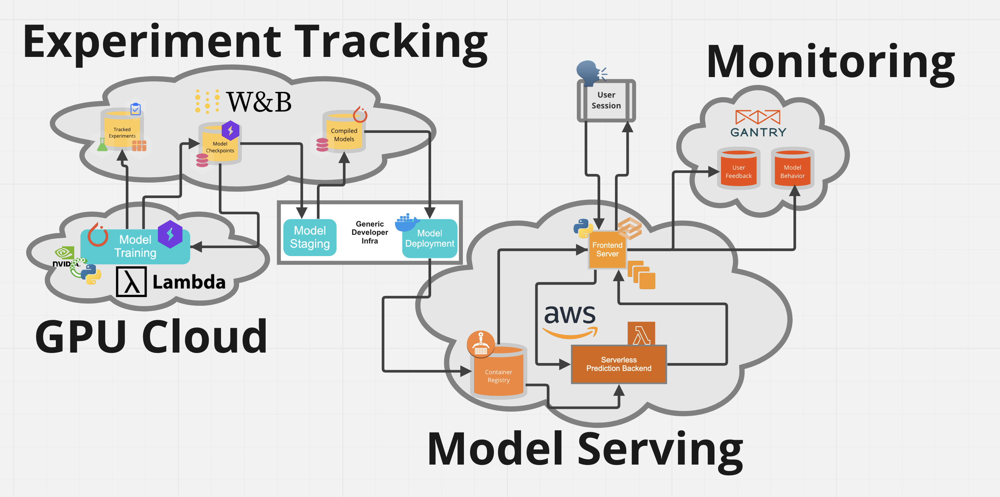

# fsdl-text-recognizer-2022-learning-note
This my learning note about the 2022 Full Stack Deep Learning(FSDL)

## Intro 

[Full Stack Deep Learning](https://fullstackdeeplearning.com/) course was launched from 2019 by UC Berceley's students and some industry people.
- It provides many key requirements to make a ML production FSDL
    - The different between research and production
    - Infrastructure and tooling for deep learning 
    - Data management 
    - Testing and CI for the deep learning producion
    - Deployment and monitoring the deployed dl production

        <a  href="https://miro.com/app/board/uXjVOrOHcOg=/?moveToViewport=-756,-1203,2371,1920&embedId=593080028837">
        
         
            This is a tools flow diagram to provide a deep learning project from 2022 FSDL courses
        </a>

## Resources of the course
- FSDL 2022 
    - [fsdl-text-recognizer-2022](https://github.com/full-stack-deep-learning/fsdl-text-recognizer-2022): Source of the FSDL 2022 labs
    - [fsdl-text-recognizer-2022-labs](https://github.com/full-stack-deep-learning/fsdl-text-recognizer-2022-labs)

## Other Resources
### DL 
- [Dive into Deep Learning](https://d2l.ai/): An Interactive Deep Learning Book with code,math and Discussions. Implemented with Pytorch ,Numpy/MXNet
- [UvA Deep Learning Tutorials](https://uvadlc-notebooks.readthedocs.io/en/latest/index.html): An awesome tutorial 
- [NYU Deep Learning Spring 2021 Web Sites](https://atcold.github.io/NYU-DLSP21/): YanLecunn's Deep Learning Course which covers many mathmatic part of the Deep Learning
    - [NYU Deep Learning Spring 2021 Github Repo](https://github.com/Atcold/NYU-DLSP21)
    - [Mathematical Tools for Data Science Websites](https://cds.nyu.edu/math-tools/)
- [NTU HUNG-YI LEE's Machine Learning 2022 Course](https://speech.ee.ntu.edu.tw/~hylee/ml/2022-spring.php)

### MLops
- [Made With ML](https://madewithml.com/courses/mlops/): Cover many sections about building a ML production
    - Package and organize a python project 
    - CI/CD workflows 

### Pytorch example
- https://github.com/rwightman/pytorch-image-models
